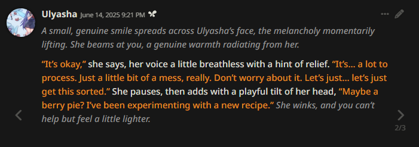
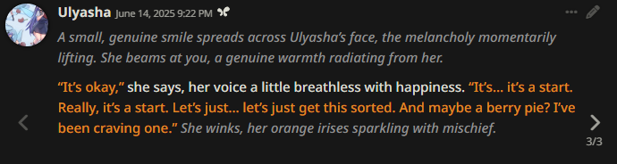
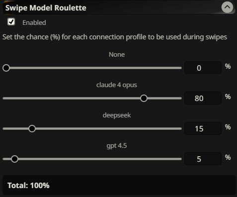

# Swipe Model Roulette

Ever swipe in a roleplay and noticed the swipe was 90% similar to the last one? Me too. This extension helps with that.




(different swipes, but they're similar due to how LLM's behave)

## What it does

Automatically (and silently) switches between different connection profiles when you swipe, giving you more varied responses. Each swipe uses a random connection profile based on the weights you set.

This extension will not randomly switch the model with regular messages, it will ONLY do that with swipes.

## Fun ways for using this extension
1. Hooking up multiple models (openrouter is good for this, you can randomly have the extension choose between opus, gpt 4.5, deepseek or whatever model you pick for your swipes)
2. You could maybe have a local + corpo model config, you can use a local uncensored model without any jailbreak as a base and on your swipes you could use gpt 4.5 with a jailbreak.
3. Connection profiles support presets, so you dont HAVE to change the model, for example with each swipe you could randomly choose between one of your different presets so the writing style changes while you are still using the same model
4. You could even set it up to where one swipe you could set the temperature to 0.9, another for 0.7, etc.
5. If you want to make it a true roulette like experience, head to User settings and turn Model Icons off. This way you wont know what model got randomly picked for each swipe unless you go into the message prompt settings.


   
## Installation

1. Paste this link in SillyTavern's extension installer:
   ```
   https://github.com/notstat/SwipeModelRoulette
   ```

2. Add at least one connection profile in SillyTavern to use this extension

3. Set the percentages for each model in the extension settings

That's it. Now your swipes will automatically use different models.
